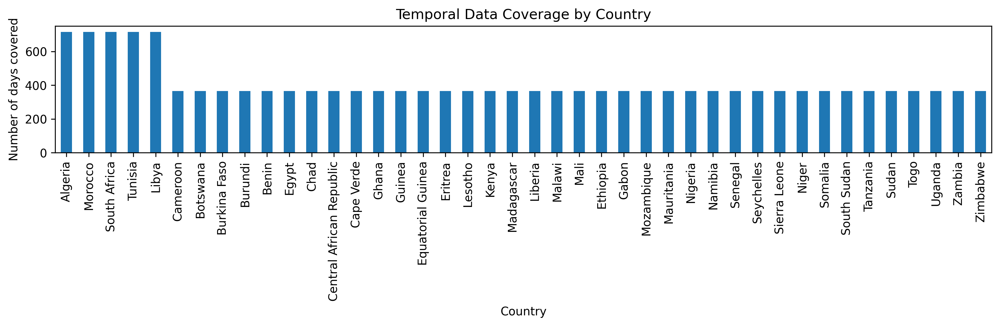
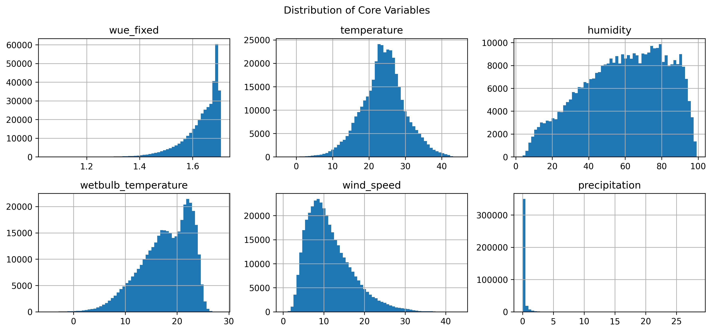
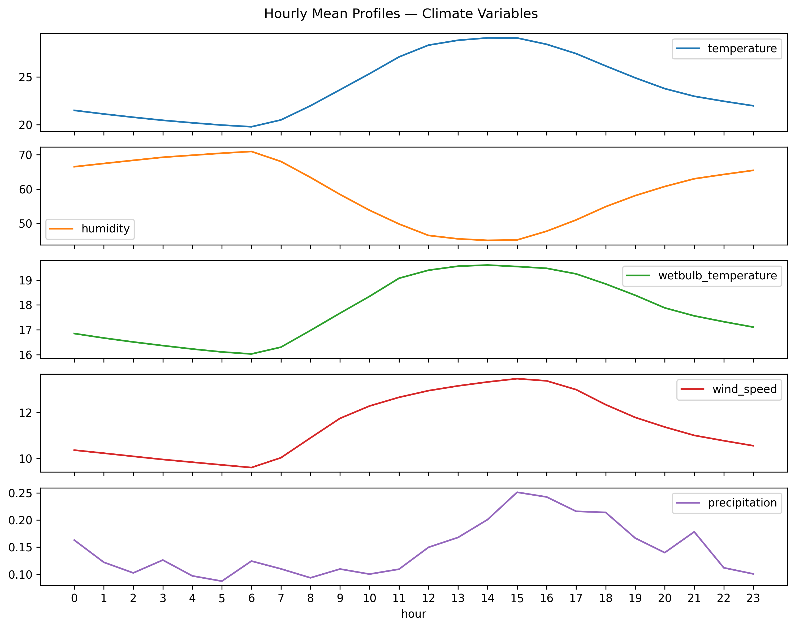
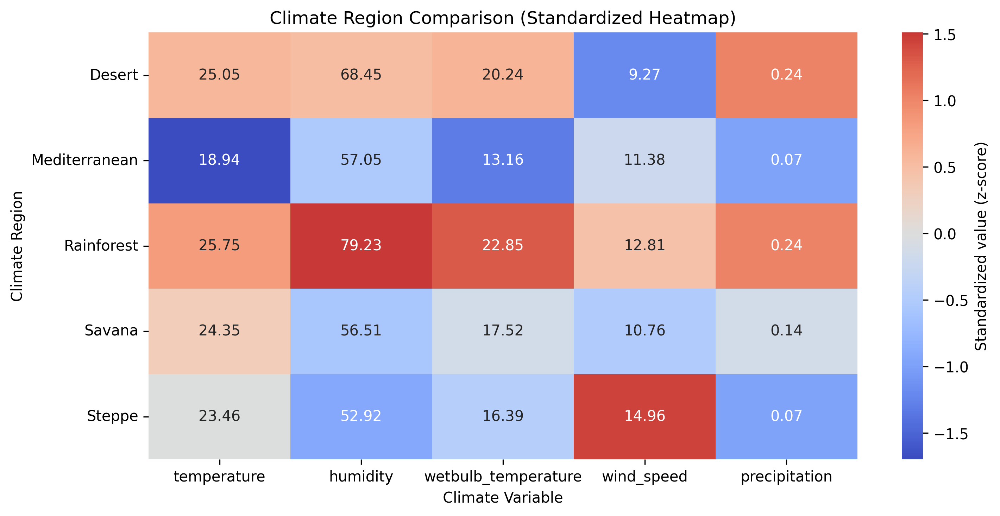
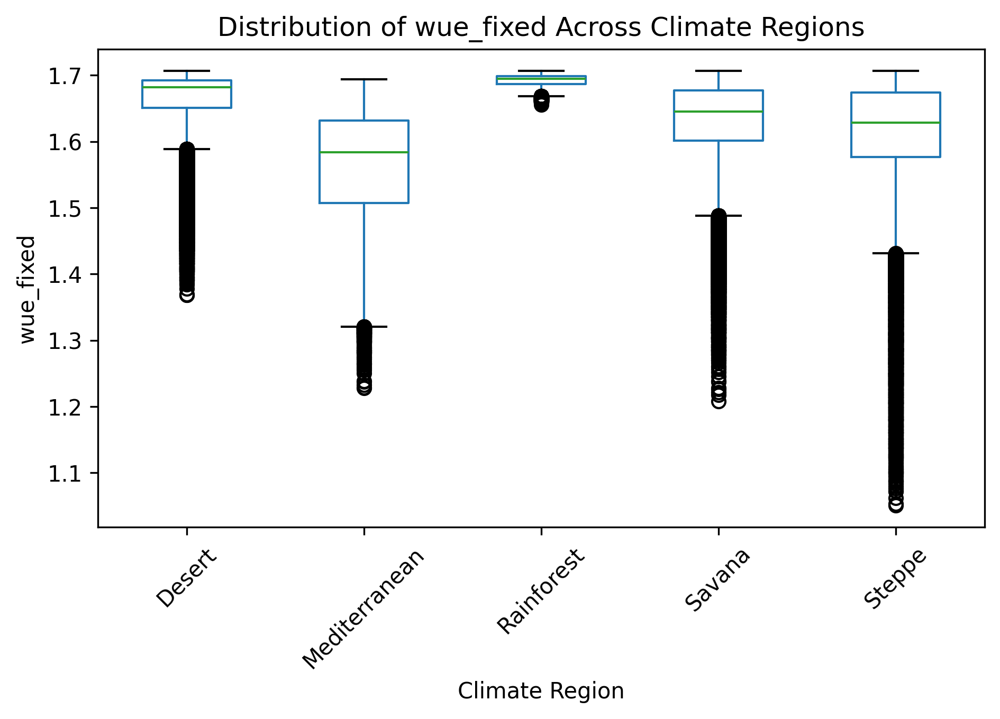
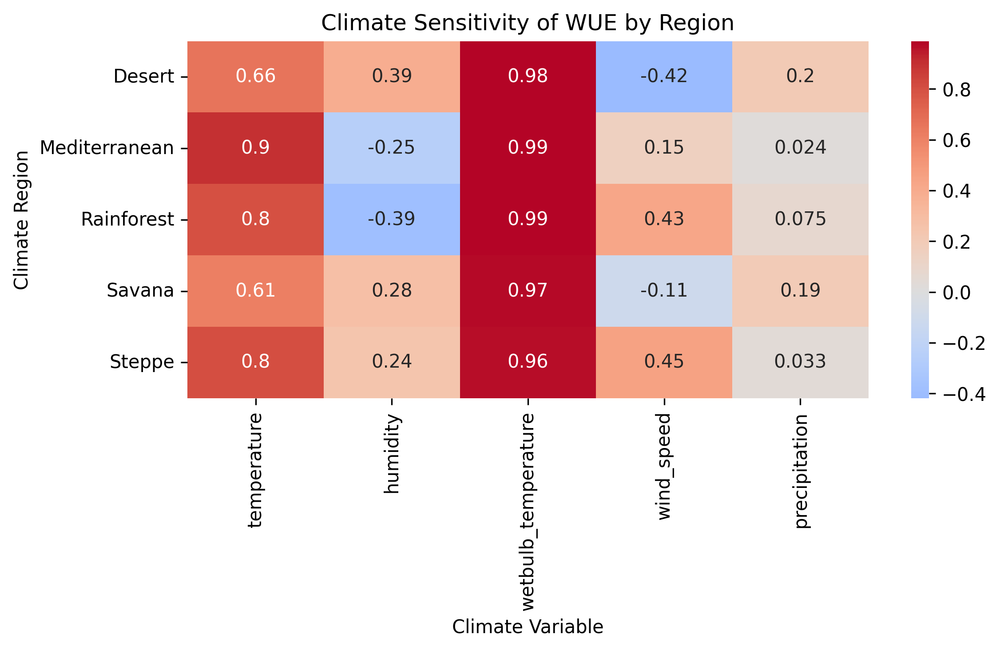
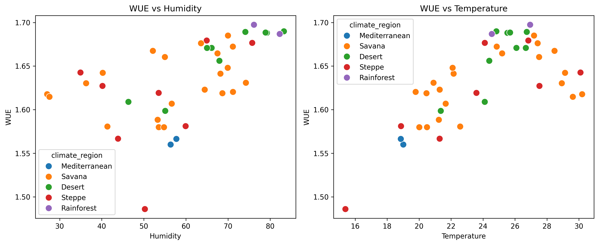
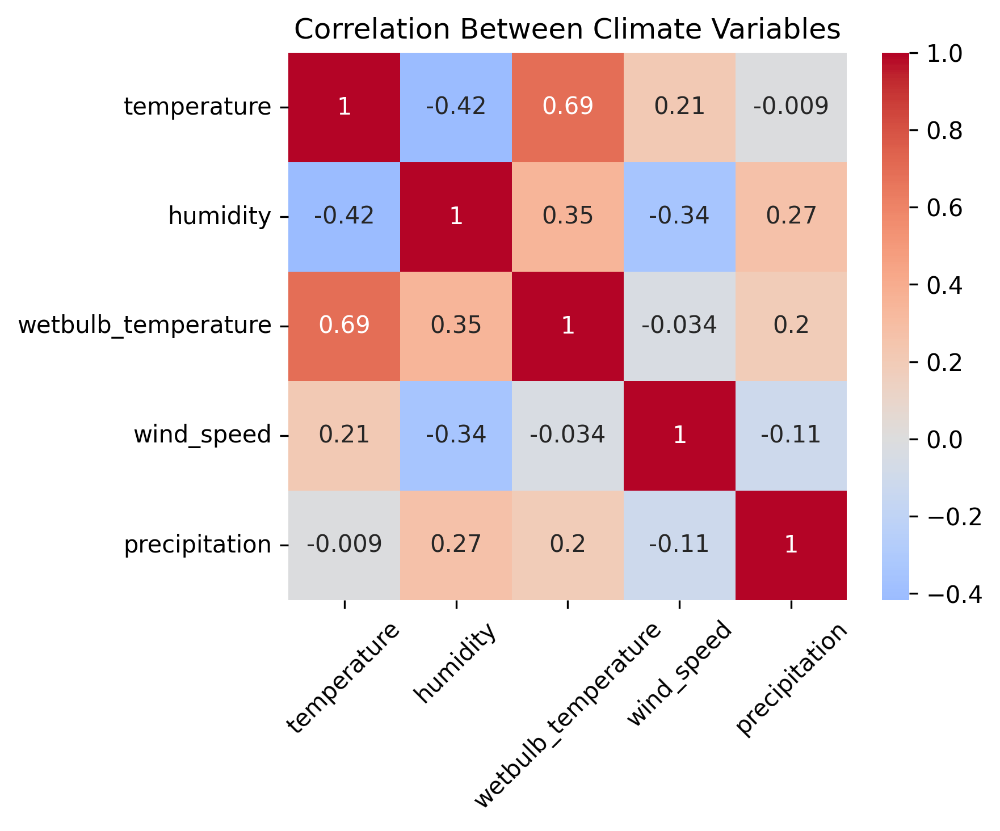
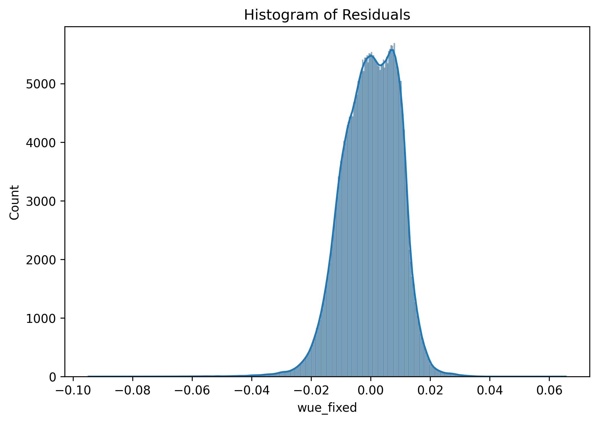
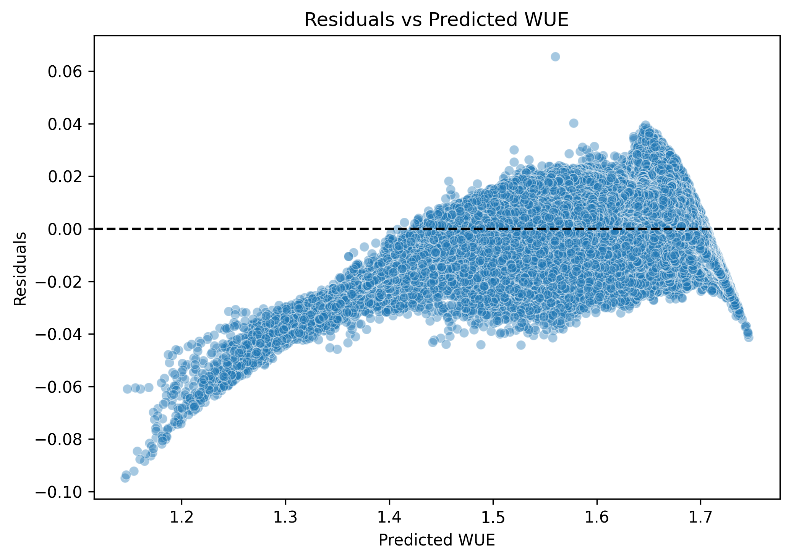

# Results

## Project goal

This project investigates how climatic conditions influence **Water Usage Effectiveness (WUE)** in African data centers.  
The goal is to identify the main climate drivers of WUE and evaluate whether their impact varies across climate regions.

---

## Why this matters

Data centers rely on cooling systems, which are strongly affected by environmental conditions.  
In water-constrained regions, inefficient cooling increases resource consumption.

Understanding the relationship between climate and WUE helps:
- identify suitable locations for data centers  
- assess environmental risks  
- improve sustainable infrastructure planning  

---

## Data overview

The dataset contains **382,968 observations** across multiple African countries and climate regions.

It includes:
- **WUE (target variable)**
- Climate variables:
  - temperature  
  - humidity  
  - wet-bulb temperature  
  - wind speed  
  - precipitation  
- Temporal features (date, hour)
- Geographic information (country, climate region)

---

## Data validation and preprocessing

### Wet-bulb temperature consistency

Wet-bulb temperature values appeared inconsistent with physical expectations.  
Since wet-bulb temperature should not exceed air temperature, a diagnostic check was performed.

A high violation rate suggested the variable was recorded in **Fahrenheit instead of Celsius**, and values were converted accordingly.

---

### Outlier detection

Outliers were identified using the **IQR method**.  
Extreme values were present but represented a small proportion of the data and were considered plausible.

---

## Descriptive analysis

### Temporal coverage

Compute and plot temporal coverage (in days) per country.

Goal: understand the observations time span. 
- Do all countries have the same observation period?

Countries differ in observation periods.  
Some countries (e.g. Algeria, Morocco, South Africa) have close to **two years of data**, while others have around **one year**, indicating an unbalanced dataset.

---

### Variable distributions

Distribution check 
Purpose: understand shape (skewness), spread, and extreme values

Climate variables show:
- skewed distributions  
- heavy tails  
- presence of extreme values  

This supports the inclusion of nonlinear terms in the analysis.

---

### Hourly climate profiles

- Temporal validation of climate variables
    -Variables behaving smoothly over time?
    -Diurnal patterns make physical sense?
Goal: Confirms data behaves reasonably before comparisons.

Hourly patterns are smooth and consistent, indicating:
- realistic temporal behavior  
- no aggregation issues  

---

## Regional analysis

### Climate comparison across regions

Goal: Identify systematic geographic differences.
- Do climate regions differ systematically in their climate conditions and in WUE?

We then explore spatial patterns:
• Compare mean and distribution of avg_wue_fixed across climate regions (Desert, Savanna, Rainforest...).
• Identify regions that tend to exhibit higher or lower water usage effectiveness.
Results remain descriptive and comparative.

Climate conditions vary significantly across regions.  
Equal-weight averaging ensures that results are not dominated by countries with more observations.

---

### WUE distribution by region

WUE differs across climate regions, indicating that environmental conditions influence cooling efficiency.

Regions with extreme heat or high humidity tend to show less favorable WUE values.

---

## Climate sensitivity

Purpose: Examine relationships between climate and WUE.
We analyze how WUE varies with physical climate drivers:
• Explore relationships between wue_fixed and climate_vars.
• Use scatter plots and correlation measures to assess directional patterns.
This phase still motivates later modeling and does not asserting causality.

Temperature and humidity are the dominant drivers of WUE.

Their influence varies by region:
- stronger temperature effects in Mediterranean and Steppe climates  
- stronger humidity effects in Desert region

---

## Climate gradients

This plot shows how WUE changes along climate conditions.
Each point represents a country, positioned by its average climate values.
It helps visualize whether countries in wetter or warmer climates tend to have higher WUE.
For example, rainforest countries may appear in the high-humidity, high-WUE area, while Mediterranean countries may appear in the lower-humidity, lower-WUE area.

In this way, the plot complements the correlation heatmap by showing where countries actually lie in the climate space, not just the numerical correlations

Scatterplots confirm:
- a clear relationship between WUE and climate variables  
- nonlinear patterns, especially for temperature and humidity  

---

## Regression analysis

### Climate variable correlation

Correlation analysis indicates a potential multicollinearity issue among climate variables. 
Wet-bulb temperature shows an extremely high correlation with WUE (0.97–0.99) across all climate regions. 
This may partly reflect the fact that wet-bulb temperature is derived from temperature and humidity, making these variables related.

Before proceeding with regression analysis, we examine the correlations among climate variables themselves to assess the degree of multicollinearity and ensure more reliable model estimation. 

Climate variables show some degree of correlation, which is important to consider when interpreting regression results.

---

### Residual diagnostics

Residuals are approximately normally distributed.

Residual patterns indicate nonlinear relationships, suggesting that simple linear models are not sufficient.

---

### Regression performance

Regression results show:
- high explanatory power of climate variables  
- strong influence of temperature and humidity  
- evidence of nonlinear effects  

Regional regressions confirm that climate sensitivity varies across regions.

---

## Main findings

- **Temperature and humidity are the main drivers of WUE**
- Climate effects are **nonlinear**, especially at extreme values  
- The relationship between climate and WUE varies across regions  
- Moderate climate conditions lead to better cooling efficiency  
- Extreme heat and high humidity reduce performance  

---

## Conclusion

Climate plays a critical role in determining water efficiency in data centers.

These results highlight the importance of:
- considering regional climate differences  
- accounting for nonlinear environmental effects  
- selecting locations with favorable climate conditions  

Overall, the analysis shows that **moderate and stable climates are most suitable for water-efficient data center operation**.